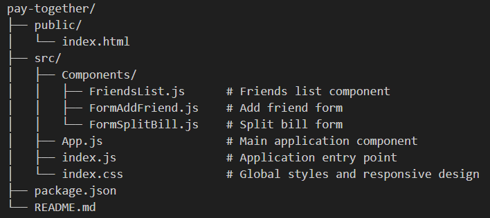

# 💰 Pay Together

A modern, responsive React application for splitting bills and tracking expenses with friends. Easily manage who owes whom and keep track of your shared expenses.

 

## ✨ Features

- 👥 **Friend Management**: Add friends with their name and profile image
- 💸 **Bill Splitting**: Split bills with friends by entering bill amount and expenses
- 📊 **Balance Tracking**: Automatically track who owes whom
  - 🟢 Green: You owe your friend
  - 🔴 Red: Your friend owes you
  - ⚫ Black: You're even
- 📱 **Responsive Design**: Works seamlessly on desktop, tablet, and mobile devices
- 🎨 **Modern UI**: Clean and intuitive user interface

## 🚀 Getting Started

### Prerequisites

- Node.js (v14 or higher)
- npm or yarn

### Installation

1. Clone the repository
```bash
git clone <https://github.com/hermouchDev/Pay-Together>
cd pay-together
```

2. Install dependencies
```bash
npm install
```

3. Start the development server
```bash
npm start
```

4. Open [http://localhost:3000](http://localhost:3000) in your browser

## 📜 Available Scripts

In the project directory, you can run:

### `npm start`
Runs the app in development mode. Open [http://localhost:3000](http://localhost:3000) to view it in your browser.

### `npm test`
Launches the test runner in interactive watch mode.

### `npm run build`
Builds the app for production to the `build` folder. It correctly bundles React in production mode and optimizes the build for the best performance.

## 🏗️ Project Structure



## 🎯 How to Use

1. **Add a Friend**: Click the "Add Friend" button, enter your friend's name and image URL
2. **Select a Friend**: Click "Select" on any friend in the list to split a bill
3. **Split a Bill**: 
   - Enter the total bill amount
   - Enter your expense
   - Select who is paying the bill
   - Click "Split bill"
4. **Track Balances**: View balances next to each friend's name (color-coded for easy identification)

## 🛠️ Technologies Used

- **React** 19.2.0 - UI library
- **CSS3** - Styling with responsive design
- **React Hooks** - State management (useState)

## 📱 Responsive Design

The app is fully responsive with breakpoints for:
- **Desktop**: Full two-column layout
- **Tablet** (< 900px): Stacked layout with optimized forms
- **Mobile** (< 600px): Single column with mobile-friendly buttons and spacing

## 🤝 Contributing

Contributions, issues, and feature requests are welcome!

## 👤 Author

Hermouch Abdelmajid

---

Made with ❤️ using React
